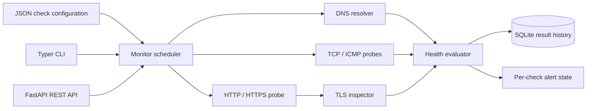

# NetSentinel

**Networking · Cybersecurity · Observability**

NetSentinel is a lightweight service monitoring and diagnostic system for teams that need evidence before they can answer “why is the system down?”

## Problem

Small organizations often learn about an outage from a user complaint. An administrator must then manually separate DNS failure, routing or reachability, a closed port, an HTTP failure, certificate trouble, and high latency. That serial investigation increases downtime.

## Who This Helps

Schools, SMEs, startups, local businesses, and small IT departments operating routers, internal servers, websites, APIs, VPN gateways, printers, databases, or cloud endpoints without a dedicated network operations team.

## Why It Matters

A single “down” result is not a diagnosis. NetSentinel preserves protocol-specific evidence, latency, failure streaks, uptime history, and alert state so an operator can see both the immediate fault domain and whether it is recurring.

## Constraints

- Runs without a paid monitoring service or external agent.
- Uses SQLite by default and can operate on one modest host.
- Applies explicit network timeouts and bounded configuration values.
- Supports ICMP only where the operating system provides `ping` and the runtime has permission.
- Observes from one network vantage point; it cannot prove global availability.

## Solution

Checks are persisted definitions rather than shell commands. A scheduler dispatches them to reusable DNS, TCP, HTTP, TLS, or ICMP probes. Every probe returns the same timestamped result model. Results are stored, converted into uptime percentages, and evaluated against per-check consecutive-failure thresholds. The REST API and CLI call this same domain layer.

## Architecture



See [the detailed architecture](docs/architecture.md), [security design](docs/security.md), and [threat model](docs/threat-model.md).

## Implemented Features

- IPv4/IPv6 DNS resolution with complete address evidence.
- Timed TCP connection checks with validated ports.
- HTTP/HTTPS checks with expected-status evaluation, redirects, final URL, and content type.
- TLS trust and hostname verification, SAN/issuer extraction, protocol/cipher evidence, and remaining validity days.
- Cross-platform ICMP command selection where supported.
- Persisted check inventory and timestamped SQLite history.
- Per-check failure thresholds with `OK`, `WARNING`, and `ALERT` states.
- Overall `HEALTHY`, `DEGRADED`, and `DOWN` monitoring state.
- One-shot diagnostics, configuration-driven runs, continuous watch mode, and history CLI commands.
- Responsive operator console with light/dark themes, health KPIs, inventory filtering, monitor lifecycle controls, and protocol evidence.
- REST endpoints for registration, listing, execution, bulk runs, health, uptime, and history.
- Structured JSON operational logs.
- Non-root, read-only container deployment with a persistent data volume.

## Technology Stack

Python provides portable socket, TLS, subprocess, and SQLite primitives. FastAPI provides validated REST input and OpenAPI documentation. Typer provides an operator-focused CLI. SQLite keeps deployment inexpensive while retaining durable evidence. Pytest exercises protocol adapters, state transitions, storage, configuration, and the API without relying on public services.

## Setup

```bash
python -m venv .venv
. .venv/bin/activate
pip install -e '.[dev]'
cp .env.example .env
```

## Usage

One-shot diagnostics:

```bash
netsentinel dns example.com
netsentinel port 192.168.1.50 443
netsentinel https https://example.com
netsentinel check example.com
```

Persisted checks and continuous monitoring:

```bash
cp checks.example.json checks.json
netsentinel run checks.json --database ./data/netsentinel.db
netsentinel watch checks.json --database ./data/netsentinel.db --interval 60
netsentinel history 1 --database ./data/netsentinel.db
```

Operator console:

```bash
NETSENTINEL_DB=./data/netsentinel.db uvicorn app.api:app --host 127.0.0.1 --port 8000
# Open http://127.0.0.1:8000
```

The console never invents health data: KPIs, status, uptime, latency, and diagnostics are derived from persisted probe results. Empty inventories and checks without observations have explicit empty states.

REST API:

```bash
NETSENTINEL_DB=./data/netsentinel.db uvicorn app.api:app --host 127.0.0.1 --port 8000
curl -X POST http://127.0.0.1:8000/checks \
  -H 'content-type: application/json' \
  -d '{"name":"website","kind":"http","target":"https://example.com","expected_status":200}'
curl -X POST http://127.0.0.1:8000/checks/1/run
curl http://127.0.0.1:8000/checks/1/history
```

Container deployment:

```bash
docker compose up --build -d
docker compose ps
curl http://127.0.0.1:8000/health
```

## Testing

```bash
pytest -q
python -m compileall -q app tests
```

The suite uses fakes and protocol mocks for deterministic failure, alert, persistence, HTTP-status, and API tests. Only the localhost DNS test touches the host resolver.

## Security

Network targets are inherently sensitive and can enable server-side request forgery if the API is exposed to untrusted users. The reference API intentionally binds to loopback in Compose but does not implement identity; deploy it only on a trusted management network or behind authenticated authorization. Outbound operations have timeouts, input sizes and ports are bounded, SQLite statements are parameterized, containers run without root, and errors are truncated. Do not embed endpoint credentials in check URLs.

## Limitations

- No distributed probes, automatic discovery, notification delivery, or high-availability controller.
- ICMP success depends on host tooling and privileges; TCP and application checks remain available without it.
- Uptime is observation-based and is not an SLA calculation.
- SQLite is appropriate for a small single-instance deployment, not a horizontally scaled write workload.
- TLS inspection reports the certificate presented from this vantage point; it does not manage renewal.

## Contributing

Read [CONTRIBUTING.md](CONTRIBUTING.md). Changes to probe or state behavior must include deterministic tests and must not depend on a paid service.
