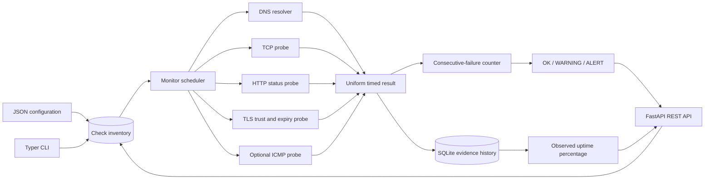
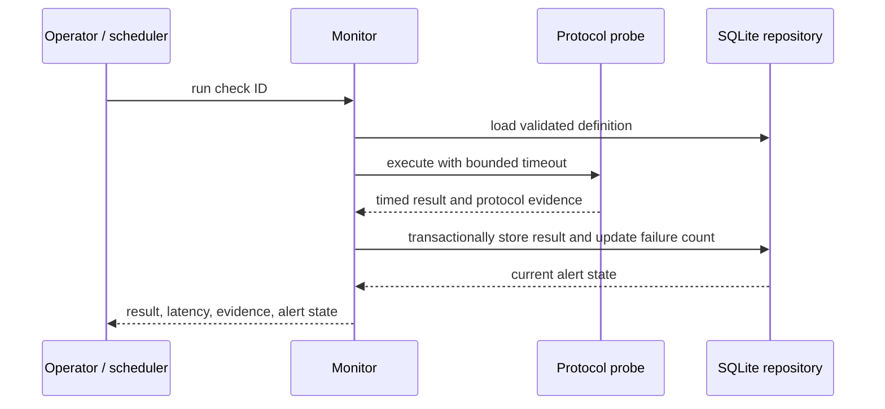

# NetSentinel Architecture

## System context

NetSentinel separates protocol observation from monitoring policy. Operators register validated check definitions through JSON configuration, CLI, or REST. The monitor dispatches each definition to an independent protocol probe, persists uniform evidence, advances that check's failure counter, and derives both per-check alert state and aggregate service state. Delivery adapters do not contain probe or alert logic.

## Component diagram

## Runtime sequence

## Persistence model

- `checks` stores unique names, protocol kind, target, port, expected HTTP status, timeout, threshold, enablement, and consecutive failures.
- `results` stores immutable timestamps, health decisions, latency, and structured protocol evidence linked by a foreign key.
- The `(check_id, checked_at)` index supports bounded recent-history and uptime queries.
- A successful observation resets only its own check's failure counter; failures increment it in the same transaction as the result insert.

## State model

A check starts at `OK`. Failures below its threshold produce `WARNING`; reaching the threshold produces `ALERT`; a subsequent success returns it to `OK`. Aggregate state is `HEALTHY` when every enabled check is `OK`, `DOWN` when every enabled check is in `ALERT`, and `DEGRADED` otherwise. With no configured checks, state is `DEGRADED` rather than a misleading success.

## Trust boundaries

1. **Administrative input:** targets cause outbound network activity and must be defined only by trusted operators.
2. **Outbound network:** DNS answers, endpoints, redirects, certificates, and latency are untrusted observations.
3. **Domain boundary:** all probes return the same bounded evidence object before policy evaluation.
4. **Persistence boundary:** parameterized writes keep configuration separate from SQL and retain decision evidence.
5. **Presentation boundary:** CLI and API serialize domain results without exposing tracebacks or response bodies.

## Failure behavior

DNS, socket, HTTP, TLS, and ICMP failures become unhealthy results with bounded error type and message. A failure in one check does not stop remaining checks. Disabled checks are not scheduled. Network timeouts are configurable from 0.1 to 30 seconds, continuous scheduling is supervised externally, and the stored history remains available after process restart.
