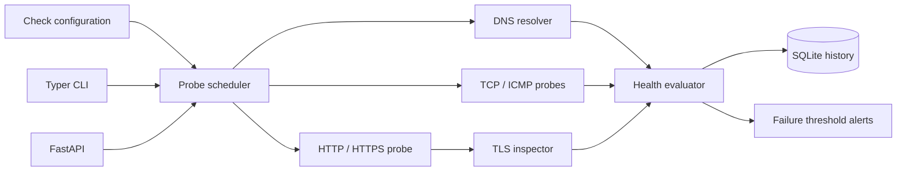

# NetSentinel Architecture

## System context

NetSentinel is organized around independent probes rather than one monolithic ping command. The scheduler invokes DNS, socket, web, ICMP, and certificate adapters. Every adapter returns the same timed result shape, allowing the health evaluator to derive `HEALTHY`, `DEGRADED`, or `DOWN` consistently. Results feed SQLite uptime history and the consecutive-failure alert tracker. The CLI and REST API call the same domain functions, so interfaces do not duplicate diagnostic policy.

## Component diagram

## Data and control flow

The solid arrows show runtime data or control flow. Dotted arrows, where present, describe policy rather than runtime connectivity. Domain decisions remain independent of CLI and HTTP delivery so they can be tested without binding sockets or paid services. Inputs are validated before persistence or outbound I/O, and evidence is retained at the point where the system makes an operational decision.

## Trust boundaries

1. **External input boundary:** network targets, telemetry, identity requests, documents, logs, or field records are untrusted.
2. **Domain boundary:** validated values enter deterministic policy and state-transition logic.
3. **Persistence boundary:** parameterized or structured writes protect stored operational evidence.
4. **Operator boundary:** alerts, conflict choices, infrastructure deployment, and other consequential actions remain explicit operator responsibilities.

## Failure behavior

Adapters return explicit errors or states rather than manufacturing successful results. Timeouts and unavailable dependencies affect only the relevant operation. The limitations documented in the README define what cannot be inferred from the available evidence.
